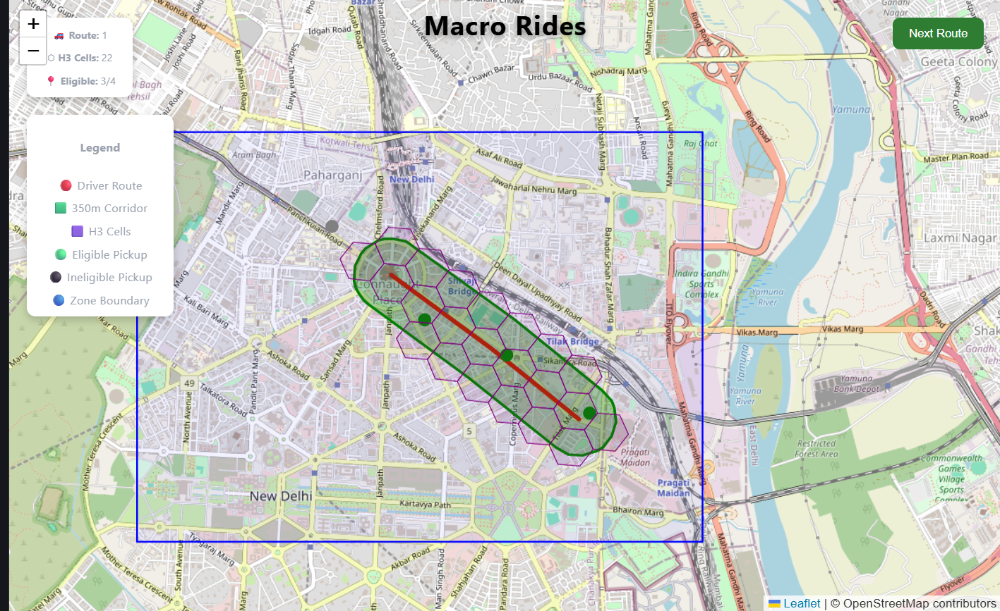

# Macro Rides – Route Corridor Visualization

A React + TypeScript web application that visualizes a simulated driver's route and identifies eligible pickup points using a **350-meter corridor** and **H3 spatial indexing**.

---

## Overview

This project simulates a driver's route in **Delhi NCR** and demonstrates how geospatial indexing can be used to efficiently identify eligible pickup locations.

The application generates a 350-meter buffer around the driver's route using **Turf.js**, converts the corridor into **H3 hexagonal cells**, and checks whether each pickup location falls inside the corridor. The entire workflow is visualized on an interactive **Leaflet** map.

---

## Features

* 🚗 Simulated driver routes
* 🟩 350m route corridor generation using Turf.js
* 🟪 H3 spatial indexing (Resolution 9)
* 📍 Eligible pickup detection
* 🗺️ Interactive Leaflet map visualization
* 🔄 Dynamic route switching
* 🔵 Zone boundary visualization

---

## Tech Stack

* React
* TypeScript
* Vite
* React Leaflet
* Leaflet
* Turf.js
* H3-js

---

## How It Works

1. A simulated driver route is defined using latitude and longitude coordinates.
2. Turf.js creates a 350-meter buffer corridor around the route.
3. The corridor polygon is converted into H3 hexagonal cells.
4. Pickup locations are assigned H3 cells.
5. Pickup eligibility is determined by checking whether the pickup's H3 cell lies inside the corridor.
6. The route, corridor, H3 grid, and pickup locations are displayed on an interactive map.

---

## Installation

Clone the repository

```bash
git clone https://github.com/Goodwill-max/route-corridor.git
```

Navigate to the project

```bash
cd route-corridor
```

Install dependencies

```bash
npm install
```

Run the application

```bash
npm run dev
```

---

## Screenshots

### Route 1


### Route 2



---

## Future Improvements

* Real-time GPS route updates
* Backend API integration
* Automatic route optimization
* Live driver tracking
* Dynamic pickup requests
* Responsive mobile interface

---

## Author

**Pankhuri Sachan**
